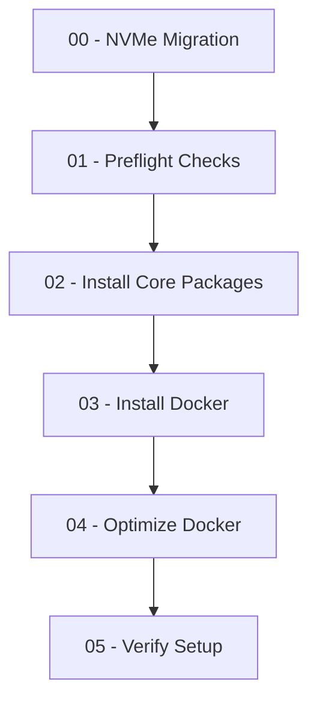

# Bootstrap

> This Bootstrap initializes a clean Ubuntu host into a Docker-ready Raspberry Pi environment.
Tested on: Ubuntu 22.04 LTS / 24.04 LTS (ARM64, Raspberry Pi 5)

## Overview

Bootstrap prepares a clean Ubuntu system for the pi-forge infrastructure. It installs core dependencies, Docker, optimizes Docker for Raspberry Pi, and verifies the installation.
All scripts are designed to be idempotent.
Re-running them on an existing setup will not cause data loss or corruption.

## Scripts

### Execution Order



1. **`00-migrate-to-nvme.sh`** (Optional)
   - Migrates Raspberry Pi 5 from SD card to NVMe boot
   - Self-contained: installs its own dependencies (`curl`, `xz-utils`, `parted`, `fdisk`, `dosfstools`, `e2fsprogs`)
   - Requires: root privileges
   - Creates cloud-init configuration for first boot
   - Configures EEPROM for NVMe-first boot (0xf416)
   - **Note:** This script should only be run if migrating from SD to NVMe

2. **`01-preflight.sh`**
   - Performs system validation checks
   - Checks: OS (Ubuntu), architecture (ARM64), memory, disk space, internet connectivity
   - Validates required tools are available
   - Verifies sudo access (doesn't require it, but recommended)
   - Detects Raspberry Pi model
   - Optionally loads `config-registry/env/base.env` if present
   - Shows summary of pass/fail/error/warning counts
   - Can run with or without sudo (checks sudo availability)

3. **`02-install-core.sh`**
   - Installs core system dependencies
   - Packages: `curl`, `wget`, `git`, `jq`, `yq`, `gettext-base`, `ansible`, `rsync`, `htop`, `vim`, `unzip`, `ca-certificates`, `gnupg`, `lsb-release`, `software-properties-common`
   - Raspberry Pi specific: `rpi-eeprom`, `nvme-cli`, `util-linux`, `dosfstools`, `e2fsprogs`, `parted`, `pv`
   - Requires: sudo privileges

4. **`03-install-docker.sh`**
   - Installs Docker Engine and Docker Compose
   - Adds current user to `docker` group
   - Enables Docker service (does not start yet)
   - Requires: sudo privileges
   - **Note:** Docker daemon configuration is handled by `04-optimize-docker.sh`

5. **`04-optimize-docker.sh`**
   - Configures Docker daemon for optimal Raspberry Pi performance
   - Settings: `overlay2` storage driver, log rotation, IP pools, `live-restore`, disabled `userland-proxy`, optimized ulimits
   - Backs up existing `daemon.json` if present
   - Starts and verifies Docker daemon
   - Requires: root privileges (uses `require_root`)

6. **`05-verify.sh`**
   - Comprehensive verification of bootstrap installation
   - Checks: Docker installation, Docker Compose, daemon status, group membership, functionality
   - Validates: tools, `/srv` directory and mount point, disk space, memory/swap, storage driver, network interfaces
   - Optional: disk throughput test (skip with `SKIP_THROUGHPUT_TEST=1`)
   - Requires: none (some checks use sudo internally)

## Quick Start

### Option 1: Using the Installer Script

```bash
curl -sSL <raw-url-to-install.sh> | bash -s <repo-url>
cd pi-forge
# Follow the printed instructions
```

### Option 2: Manual Execution

```bash
# Clone the repository
git clone <repo-url> pi-forge
cd pi-forge

# Optional: Migrate to NVMe (if needed)
sudo bash bootstrap/00-migrate-to-nvme.sh

# Run bootstrap scripts in order
sudo bash bootstrap/01-preflight.sh
sudo bash bootstrap/02-install-core.sh
sudo bash bootstrap/03-install-docker.sh
sudo bash bootstrap/04-optimize-docker.sh
bash bootstrap/05-verify.sh

# Logout and login to activate Docker group membership
```

## Dependencies & Requirements

Bootstrap scripts can run on a minimal Ubuntu 22.04+ system (ARM64).
All required packages are installed automatically as part of the process.

| Component | Provided by | Notes |
|------------|--------------|-------|
| Basic tools (`curl`, `git`, `wget`) | `02-install-core.sh` | Needed for downloads and cloning |
| Package manager (`apt-get`, `sudo`) | Ubuntu default | Checked before execution |
| Optional environment (`base.env`) | User-defined | Used for cloud-init or pre-seeding |

## Configuration

### Optional: Pre-configure Environment

If `config-registry/env/base.env` exists before running bootstrap:

- `01-preflight.sh` will load and validate it
- `00-migrate-to-nvme.sh` will use it for cloud-init configuration
- Otherwise, bootstrap runs with defaults

### After Bootstrap

1. Logout and login to activate Docker group membership
2. Verify: `docker ps` should work without sudo

## Logging

- `00-migrate-to-nvme.sh`: Logs to `/var/log/nvme-migrate.log`
- All scripts: Use consistent `log_info`, `log_warn`, `log_error`, `log_success` functions
- Color output: Enabled for TTY, disabled for non-TTY

## Error Handling

- All scripts use `set -Eeuo pipefail` for strict error handling
- Scripts use INT/TERM traps for graceful interruption handling
- `00-migrate-to-nvme.sh` includes cleanup trap (EXIT)
- Scripts fail fast on errors with clear error messages
- Verification script provides detailed diagnostics

## Troubleshooting

### Docker Group Membership

If `docker ps` requires sudo after bootstrap:

```bash
# Logout and login, or:
newgrp docker
```

### Disk Space Issues

If verification fails due to disk space:

- Ensure `/srv` is mounted on NVMe (not root filesystem)
- Check available space: `df -h /srv`
- Minimum recommended: 50GB+

### Network Issues

If package installation fails:

- Check internet connectivity: `ping -c 3 8.8.8.8`
- Verify DNS resolution: `nslookup ubuntu.com`
- Check apt sources: `cat /etc/apt/sources.list`

### NVMe Migration Issues

If migration script fails:

- Verify NVMe device is detected: `lsblk | grep nvme`
- Check device size: `lsblk -o NAME,SIZE,TYPE | grep nvme`
- Ensure sufficient space for image download (4GB+)
- Review logs: `tail -f /var/log/nvme-migrate.log`

## Files

- `install.sh` - One-liner installer script
- `utils.sh` - Common utility functions (logging, error handling)
- `00-migrate-to-nvme.sh` - NVMe migration utility
- `01-preflight.sh` - System validation
- `02-install-core.sh` - Core package installation
- `03-install-docker.sh` - Docker installation
- `04-optimize-docker.sh` - Docker optimization
- `05-verify.sh` - Installation verification

## Design Principles

1. **Independence:** Bootstrap is self-contained, no dependencies on config-registry or legacy code
2. **Minimal Dependencies:** Only essential system packages required
3. **Idempotency:** Scripts can be safely re-run (with appropriate checks)
4. **Fail Fast:** Strict error handling with clear error messages
5. **Verification:** Checks at each step
